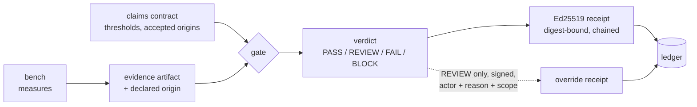

<div align="center">

# MANOLO-Bench + TRACE receipts

**A claim is not evidence until it carries a receipt.**

Measured evidence and Ed25519-signed claim receipts for the MANOLO assessment loop:
declared origins, replayable verdicts, tamper-evident history.

[](https://github.com/adambkovacs/manolo-innovation-lab-bench/actions/workflows/verify.yml)
[](LICENSE)
[](package.json)
[](package.json)

[Plain-language site](https://adambkovacs.github.io/manolo-innovation-lab-bench/) ·
[Live demo](https://adambkovacs.github.io/manolo-innovation-lab-bench/demo.html) ·
[Three-minute explainer](EXPLAINER.md) ·
[Quickstart](#quickstart-zero-dependencies-node-18)

</div>

The verify badge is an independent runner replaying the test suite and re-verifying every receipt and the ledger on each push, from the committed state alone.

The subject is the MANOLO framework's assessment loop. Deliverable D5.1 (Trustworthy Efficiency-Performance Assessment v1.0) builds claim-evidence tables for the project's four industry use cases; in the one table published in full (section 7.2.5, Table 7, pages 47 to 49), the deliverable's own annotations mark eight of fifteen claims "No direct evidence cited" and six "Requires validation study". One carries cited evidence. This is not an absence of data: the framework stores run metrics through MLflow, Thanos, and Grafana, records provenance through the D2.1 Data Operations Manager, and runs a benchmarking engine (KOBE) for performance and energy. What no component does is bind a declared claim to the specific run evidence that would support it and persist the verdict, and the table's annotations are the visible symptom. Two of the table's rows, CLAIM-4 (the system maintains sub-100 ms real-time latency) and CLAIM-7 (model compression maintains accuracy while reducing computational requirements), are exactly the shape of thing this repo measures, so that table serves as the worked example throughout.

This repo closes that loop for its own system and proposes the contract for theirs:

1. A reproducible benchmark engine produces measured evidence (latency, memory, recall).
2. Declared claims, in a small JSON contract modeled on D5.1's claim patterns, are evaluated against that evidence. Evidence carries an origin (measured, published, upstream, assumed) and each claim declares which origins it accepts, defaulting to measured, so a threshold match from a mere quote can never become PASS.
3. Every evaluation emits a canonical, Ed25519-signed receipt binding claim, threshold, measured value, verdict, and the SHA-256 digest of the evidence artifact, chained to the prior receipt and anchored in a tamper-evident ledger.
4. Verdicts are PASS, REVIEW (borderline or missing evidence), FAIL (soft miss), BLOCK (hard policy miss). Every verdict maps to an operational disposition: CONTINUE, PAUSE, or STOP. Only REVIEW is overridable, only by a named actor with a reason and scope, and the override is itself a signed receipt. Integrity failures are never overridable.



## Why this does not duplicate MANOLO

Verified against the five public deliverables (reproduction authorised with source acknowledged; D1.3 also requires author consent):

- D2.1's Data Operations Manager records provenance and lineage as semantic triplets: where an artifact came from. It does not record verdicts.
- D4.1's Policy Manager on the extended Thanos Ruler evaluates live metric streams against thresholds and raises alerts, explicitly without enforcement or a persisted verdict artifact.
- D6.1's CAE (Claims, Arguments, Evidence) within Z-Inspection is a qualitative, socio-technical evidence base; TRACE receipts position as its machine-executable counterpart, not a replacement.
- No deliverable mentions signed receipts, attestation, or claim-verdict artifacts. Checked.

A portable, signed, replayable claim-to-evidence verdict receipt is the missing piece between D5.1's claim table and D2.1's lineage graph. That is what this contributes, under Apache-2.0, using MANOLO's own vocabulary (IDP YAML per the D5.1 terms table, AIWorkloadID per D1.3 section 3.7). Everything here is MANOLO-shaped and adapter-ready, never claimed MANOLO-compatible: no public schema exists to bind against, and the receipts say so.

## Quickstart (zero dependencies, Node 18+)

```
node src/bench.js                 # measured evidence: fp32 vs int8 vs RuVector
node src/claims.js evaluate       # evaluate claims, emit signed receipt
node src/claims.js verify         # verify every receipt: signature, evidence digests, chain
node src/server.js                # API on :8787
open demo/dashboard.html          # visual console (works offline)
```

Optional Ruvnet layer: `npm install` pulls ruvector ^0.3.0 (roughly 955 MB of node_modules; skip on bad wifi, the core needs nothing). The committed results already contain a verified RuVector run.

With ruvector installed, `npm run sweep` measures the efSearch latency-recall frontier (32, 64, 100, 200) on the same seeded corpus and writes a run recommendation into evidence/ruvector-sweep.json: the lowest-p50 point whose recall clears a declared floor. The recommendation is tuner output, so it gets no special treatment: `node src/claims.js evaluate fixtures/claims-sweep.json` gates it like any other claim, and only a PASS verdict makes it a CONTINUE. Self-tuning that bypassed the gate would be the exact failure this repo exists to catch.

## Verified results

Measured 2026-08-27, Node v22.22.2, seed 42, N=5000, D=256, Q=50. Reproduce with one command.

| Series | p50 latency | p95 latency | bytes/vector | recall@10 |
|---|---|---|---|---|
| fp32 exact (ground truth) | 3.66 ms | 10.04 ms | 1024 | 1.000 |
| int8 scalar quantization | 3.38 ms | 5.35 ms | 260 | 0.988 |
| RuVector 0.3.0 HNSW (native, SIMD) | 1.076 ms | 1.387 ms | not measured | 0.944 |

Quantization buys 3.94x memory reduction for a 1.2 point recall cost. RuVector's approximate index buys 3.4x lower median latency for a 5.6 point recall cost. One fairness caveat: the latency comparison crosses runtimes (SIMD native Rust vs a JS typed-array loop), so read it as packaged-system latency for a deployment decision, not an isolated algorithmic result.

Receipt lifecycle, verified end to end in this repo's committed state: primary claim set evaluates to 3 PASS and 2 REVIEW (recall 0.944 inside a declared 0.02 margin; energy unmetered and declared so, the same "No direct evidence cited" state the D5.1 table records). The hard tail-latency set produces BLOCK (p95 10.04 ms against a 5 ms hard budget). A governed override of the REVIEW items is receipt-0003. Editing one digit of the evidence file makes receipt verification fail with the mismatched artifact named; restoring makes it pass.
The contract has also processed the real table: receipt-0007 formalizes D5.1 CLAIM-2 itself, the only Table 7 row with cited evidence (87.08 percent PSG and 86.64 percent wearable match, BOAS on OpenNeuro, Esparza-Iaizzo et al. 2024), as a published-evidence receipt. The receipt binds a source-linked transcription and its digest, not the underlying study, and says so in the evidence file. The remaining fourteen rows need only thresholds declared by the use-case owners.

## The gate versus the naive baseline

src/baseline.js is the checker most pipelines actually run: compare the number, nothing else. Fed an upstream quote of 82 ms against the D5.1 CLAIM-4 pattern (under 100 ms), the baseline prints PASS. The gate returns REVIEW and PAUSE, naming the origin: a threshold match alone is not enough to act on. Run both:

```
node src/baseline.js fixtures/claims-upstream.json
node src/claims.js evaluate fixtures/claims-upstream.json
```

When claim or evidence files legitimately evolve, older receipts for that set become SUPERSEDED: their signatures and chain linkage still verify, and only the latest receipt per claims set must match current disk. Tampering stays INVALID; history stays history.

Tried to break it (test/gate.test.js, predeclared acceptance gates, no post-hoc tuning): verdict fixtures 6/6, canonicalization variants 3/3 to one digest, tamper mutations 3/3 signature failures, duplicate claim ids rejected before any write, sign p95 under 0.1 ms and verify p95 under 0.25 ms over 500 iterations against a 10 ms gate, receipt 2930 bytes, zero network calls. Exact figures for the current machine land in results/gate-metrics.json on every run. Run `npm test`.

## Energy, carbon, and cost as claims

Energy joins the contract the only way a laptop allows: as claims over declared-origin evidence, never as estimated joules presented as measurements. Two zone evidence files transcribe published figures, source-linked, dated, and digest-bound: grid carbon intensity (Ember 2024, lifecycle, CC BY 4.0; Greece 321.65 gCO2e/kWh, Sweden 34.91, EU average 211.2) and non-household electricity prices (Eurostat nrg_pc_205, 2025-S2, band IC excluding VAT; Greece 0.1738 EUR/kWh, Sweden 0.0970).

The placement pair: identical workload-declared claims evaluated per zone. Under a hard 100 g budget, Sweden is CONTINUE and Greece is STOP for this budget, sources and digests in the receipts; the budget belongs to the workload, not the grid, and relaxing it recomputes the receipts. Placement in the cloud-edge continuum becomes receipted.

The laundering refusal: cost per million queries composes measured CPU time (p50 1.076 ms, from results.json) with an assumed 15 W draw and the upstream price. The derived 0.000779 EUR satisfies the 0.01 threshold; the artifact origin is assumed; the verdict is REVIEW and PAUSE. A threshold match must never launder an assumption into PASS.

The D5.1 CLAIM-5 row (battery and power, no direct evidence cited) is exactly this claim category. When the consortium wants live inputs, Ember and ENTSO-E both publish under CC BY 4.0 and slot into the origin field.

```
node src/claims.js evaluate fixtures/claims-place-gr.json
node src/claims.js evaluate fixtures/claims-place-se.json
node src/claims.js evaluate fixtures/claims-cost.json
```

## The two-minute demo

1. `node src/server.js`, open the dashboard.
2. Fail open: `node src/baseline.js fixtures/claims-upstream.json` passes an upstream 82 ms quote. The gate on the same input: REVIEW, PAUSE, origin named.
3. Run the benchmark: fresh measured evidence, ledger record appended.
4. Evaluate the primary claims: verdict chips render, including the honest REVIEWs and their dispositions.
5. The placement pair: identical claims against Greece and Sweden zone evidence, CONTINUE versus STOP under a declared 100 g carbon budget; then the cost claim that meets its threshold and still PAUSEs because its origin is assumed.
6. Override the borderline REVIEW with actor, reason, scope: a signed override receipt joins the chain.
7. Edit one digit in results/results.json, verify: INVALID, mismatch named. Undo, green. The CLAIM-13 data-protection concern made mechanical.
8. Close on receipt-0007: the one evidenced claim in their table, CLAIM-2, carries a receipt. The other fourteen are an afternoon with the use-case owners.

## Where each trustworthiness principle lives

The Innovation Lab brief names the principles; this table names the mechanism and the artifact that answers for each one here. GET /assess computes the same mapping live from repo artifacts, with an explicit gap per entry.

| Principle | Mechanism | Artifact |
|---|---|---|
| Accountability and auditability | Signed, chained, replayable verdict receipts over a tamper-evident ledger | results/receipts/, results/ledger.jsonl, `node src/claims.js verify` |
| Transparency and explainability | Public API contract, disclosed method fields, written limitations, every verdict carries its reason | openapi.yaml, this README, receipt `reason` fields |
| Human agency and oversight | REVIEW maps to PAUSE for a human; overrides need actor, reason, scope, and are themselves signed receipts | src/claims.js `override`, receipt-0003 |
| Reliability and robustness | Adversarial suite with predeclared gates; quality loss under compression measured, not assumed | test/gate.test.js, results/results.json |
| Efficiency and sustainability | Latency, memory, and recall measured; energy and carbon enter as declared-origin claims, never estimates presented as measurements | src/bench.js, evidence/energy-*.json, the placement pair |
| Security and misuse resistance | Ed25519 signatures, digest binding, canonical serialization; integrity failures are never overridable | src/claims.js, tamper tests |
| Safety | Hard claims BLOCK and STOP with no override path; the fail-open baseline exists to show the failure mode being prevented | fixtures/claims-block.json, src/baseline.js |

Fairness and privacy are identified as out of scope rather than skipped: no personal data enters the system, and the receipts prove claim-to-evidence binding, not model fairness; the scorecard says so per entry.

## Limitations

- The 15 W device power in the cost model is assumed and labeled assumed; the carbon and price figures are dated transcriptions (2026-08-27) of Ember 2024 and Eurostat 2025-S2 data, which age.
- The private signing key never enters the repository; each receipt embeds its public key, so verification is self-contained for any clone. Authenticity beyond that is the announced chain-head hash, not key secrecy: single local keypair, no PKI.
- Evidence origin labels are declared, not proven: the gate enforces the declared origin policy, it cannot detect a mislabeled origin. Signed origin provenance is the natural next step with the consortium.
- Claims here are self-declared about our own system; the contract's value for MANOLO is applying it to the D5.1 table with the use-case owners declaring thresholds.
- Receipts prove claim-to-evidence binding and integrity, not model safety or clinical efficacy.
- Single local Ed25519 keypair; no PKI, no external time anchor. Tamper-evident, not tamper-proof: the mitigation is publishing the receipt head hash externally at session start.
- Energy is not metered in joules; MB-ENE-01 exists to show the contract failing honestly on us.
- Synthetic seeded corpus; recall figures on real embedding distributions will differ. Latency crosses runtimes as stated above.
- The trust scorecard (GET /assess) reports implemented, partial, or absent per principle, derived only from repo artifacts, with the numeric mapping existing solely so charts render; it is a scaffold for Z-Inspection review, not a substitute, and says so in its own method field.
- RuVector findings reported constructively: silent default persistence to ./ruvector.db that ignores new dimensionality (always set storagePath), default maxElements pre-allocating roughly 4.4 GB (size it to the corpus), and a 955 MB optional install.
- agentdb (3.0.0-alpha.20, MIT OR Apache-2.0) is declared optional for a future ledger backend swap; the shipped ledger is our own 70 lines so the core stays dependency-free.

## The plain-language site

https://adambkovacs.github.io/manolo-innovation-lab-bench/ (docs/index.html on GitHub Pages): explainer, guided demo, real-life examples, FAQ. FAQ.md is the same FAQ as text. EXPLAINER.md is the three-minute technical version. docs/demo.html is the dashboard on embedded sample receipts; demo/dashboard.html is the same page in live mode against the local server.

## Licensing

This repository Apache-2.0 (LICENSE, NOTICE). ruvector MIT, agentdb MIT OR Apache-2.0, both optional and not vendored. No datasets bundled. MANOLO deliverables cited under their stated reproduction terms with sources acknowledged.
