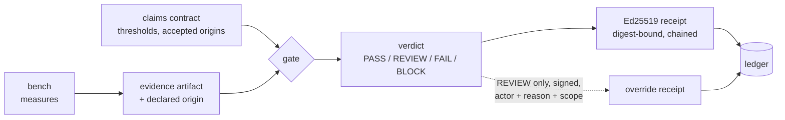

<div align="center">

# MANOLO-Bench + TRACE receipts

**A claim is not evidence until it carries a receipt.**

Measured evidence and Ed25519-signed claim receipts for the MANOLO assessment loop:
declared origins, replayable verdicts, tamper-evident history.

[](https://github.com/adambkovacs/manolo-innovation-lab-bench/actions/workflows/verify.yml)
[](LICENSE)
[](package.json)
[](package.json)

[Plain-language site](https://adambkovacs.github.io/manolo-innovation-lab-bench/) ·
[Interactive demo](https://adambkovacs.github.io/manolo-innovation-lab-bench/demo.html) ·
[Three-minute explainer](EXPLAINER.md) ·
[Quickstart](#quickstart-zero-dependencies-node-18)

Judge's path, five stops: 1) the problem, D5.1's own evidence-status table; 2) the failure, a naive checker passing an upstream quote; 3) the intervention, a gate that checks the evidence basis and binds the decision into a signed receipt; 4) the result, deterministic verdicts, semantic replay, tamper detection, measured overhead; 5) the limits, declared origins, a pinned single-signer trust list, no proof of model safety.

</div>

The verify badge is this repository's CI, nothing more: on every push, GitHub Actions checks out the repo, runs the tests, and re-verifies every receipt and the ledger. Edit evidence or a receipt without re-signing the chain and the next push turns the badge red.

## The problem

The subject is the MANOLO framework's assessment loop. Deliverable D5.1 assesses trustworthiness by listing the claims each use case makes and the evidence behind them. In the one claims table published in full (section 7.2.5, Table 7, pages 47 to 49, reproduced there from D6.1 Table 16), the evidence column is titled "Evidence from Case Log". For eight of fifteen claims it reads "No direct evidence cited". For six more, "Requires validation study". One claim cites evidence.

For most rows the data is not missing: MANOLO stores run metrics in MLflow, Thanos, and Grafana, records provenance in the D2.1 Data Operations Manager, and benchmarks workloads with KOBE. What is missing is the connection: the log is attached to the run, but nothing attaches the claim to the run, and nothing keeps the verdict. The table's annotations are what that gap looks like from the outside.

Two of those rows describe things a benchmark can measure directly: CLAIM-4 (sub-100 ms real-time latency) and CLAIM-7 (compression keeps accuracy while cutting compute). That table is the worked example throughout this repo, and only the example: the contract knows nothing about any use case, the co-design process behind the table ran for every use case (D6.1 sections 3.1.7 to 3.3.7; the wearable table is the only published one that pairs claim IDs with evidence status), and nine of the eleven committed receipts have nothing to do with wearables: eight gate energy, cost, and this repo's own benchmark claims, and one records a governed override.

## What this builds

This repo builds the missing connection, demonstrates it on its own system, and proposes the contract to MANOLO:

1. A reproducible benchmark produces measured evidence: latency, memory, recall.
2. Claims are small JSON contracts modeled on D5.1's claim patterns. Each claim names a threshold and the evidence origins it accepts: measured, published, upstream, or assumed. A number that meets its threshold but comes from the wrong origin gets REVIEW, not PASS. A quote is not a measurement.
3. Every evaluation becomes a signed receipt. It binds the claim, the threshold, the measured value, the verdict, and a SHA-256 digest of the evidence file, and it chains to the previous receipt. Edit anything afterwards and verification fails. Verification demands four things at once: the signer's key fingerprint is pinned in results/keys/trusted-signers.json, the signature verifies, the evidence digests match disk, and semantic replay recomputes every verdict from the bound claim and evidence files and gets the same answer. A trusted key signing a wrong verdict fails the fourth check. A clean clone can verify all of this and cannot mint an authorised receipt: creating a signing key is an explicit `keygen` whose fingerprint registration shows up in git diff.
4. Verdicts are PASS, REVIEW (borderline or missing evidence), FAIL, and BLOCK (hard policy miss). Each maps to an action: CONTINUE, PAUSE, or STOP. Only REVIEW can be overridden, only by a named person with a reason and a scope, and the override is itself a signed receipt. Integrity failures can never be overridden.



## Why this does not duplicate MANOLO

Checked against nine public deliverables (D1.2, D1.3, D2.1, D4.1, D5.1, D6.1, D7.1, D7.2, D8.3):

- D2.1's Data Operations Manager records where every artifact came from (provenance and lineage). It does not record verdicts.
- D4.1's Policy Manager evaluates policies over live metric streams and raises and logs alerts, in its own words "without executing remediation or recovery actions". It never handles a claim; the word does not appear in the deliverable.
- D6.1's Claims, Arguments, Evidence process inside Z-Inspection® is a human process for weighing claims. TRACE receipts are its machine-readable counterpart, not a replacement.
- D8.3's data provenance is documentation: README files following Dublin Core and W3C PROV-DM, with file integrity delegated to the storage layer (Zenodo's MD5 checksums). No claim binding, no verdict record.
- No deliverable mentions signed receipts, attestation, or claim-verdict artifacts. Checked.

The missing piece between D5.1's claim table and D2.1's lineage graph is a portable, signed, replayable verdict receipt. That is the contribution, under Apache-2.0, using MANOLO's own vocabulary (IPD YAML from D5.1 section 3.1.2, AIWorkloadID from D1.3 section 3.7). Everything here is MANOLO-shaped and adapter-ready. Nothing claims MANOLO compatibility, because no public schema exists to bind against.

## Quickstart (zero dependencies, Node 18+)

```
node src/bench.js                 # measured evidence: fp32 vs int8 vs RuVector
node src/claims.js evaluate       # evaluate claims, emit signed receipt
node src/claims.js verify         # every receipt: trusted signer, signature, evidence digests, chain, semantic replay
node src/claims.js replay receipt-0006.json   # recompute one receipt's verdicts from its bound inputs
node src/claims.js keygen         # first evaluation on a fresh clone needs this explicit step
node src/server.js                # API on :8787
open demo/dashboard.html          # visual console (works offline)
```

Optional Ruvnet layer: `npm install` pulls ruvector ^0.3.0 (roughly 700 MB of node_modules observed here, platform-dependent; skip on bad wifi, the core needs nothing). The committed results already contain a verified RuVector run.

With ruvector installed, `npm run sweep` measures the efSearch latency-recall frontier (32, 64, 100, 200) on the same seeded corpus. It writes evidence/ruvector-sweep.json with a run recommendation: the fastest point whose recall clears a declared floor. The recommendation gets no special treatment. `node src/claims.js evaluate fixtures/claims-sweep.json` gates it like any other claim, and only PASS makes it a CONTINUE. A tuner that could bypass the gate would be the exact failure this repo exists to catch.

## Verified results

Measured 2026-08-27, Node v22.22.2, seed 42, N=5000, D=256, Q=50. Reproduce with one command.

| Series | p50 latency | p95 latency | bytes/vector | recall@10 |
|---|---|---|---|---|
| fp32 exact (ground truth) | 3.66 ms | 10.04 ms | 1024 | 1.000 |
| int8 scalar quantization | 3.38 ms | 5.35 ms | 260 | 0.988 |
| RuVector 0.3.0 HNSW (native, SIMD) | 1.076 ms | 1.387 ms | not measured | 0.944 |

Quantization buys a 3.94x smaller encoded vector payload for a 1.2 point recall cost (payload bytes, not process memory). RuVector's approximate index buys 3.4x lower median latency for a 5.6 point recall cost. One caveat: the RuVector number comes from native SIMD Rust and the others from a JavaScript loop, so the comparison tells you what the packaged systems do, not which algorithm is faster.

The receipt lifecycle is verified end to end in the committed repo. The primary claim set evaluates to 3 PASS and 2 REVIEW. One REVIEW is recall 0.944 sitting inside a declared 0.02 margin; the other is energy, unmetered and declared so, the same "No direct evidence cited" state the D5.1 table records. A hard tail-latency claim produces BLOCK (p95 10.04 ms against a 5 ms budget). Receipt-0003 is a governed override of the REVIEWs. Edit one digit of the evidence file and verification fails, naming the file; restore it and verification passes.

The contract has also processed the real table. Receipt-0007 formalizes D5.1 CLAIM-2, the only Table 7 row with cited evidence (87.08 percent PSG and 86.64 percent wearable match, BOAS on OpenNeuro, Esparza-Iaizzo et al. 2024). The receipt binds a source-linked transcription and its digest, not the underlying study, and says so in the evidence file. An afternoon with the use-case owners turns the remaining fourteen rows into contracts. The rows with run evidence nearby get real verdicts; the six marked "Requires validation study" get the honest verdict they deserve today, REVIEW on the record until the studies run.

## The gate versus the naive baseline

src/baseline.js is the naive checker: compare the number against the threshold, nothing else. Fed an upstream quote of 82 ms against the CLAIM-4 pattern (under 100 ms), it prints PASS. The gate, on the same input, returns REVIEW and PAUSE and names the origin. A number that meets a threshold is not yet a reason to act. Run both:

```
node src/baseline.js fixtures/claims-upstream.json
node src/claims.js evaluate fixtures/claims-upstream.json
```

When claim or evidence files legitimately evolve, older receipts for that set become SUPERSEDED: their signatures and chain links still verify, and only the latest receipt per claims set must match current disk and replay semantically. Superseded receipts preserve signed decision history; replaying their original decision also requires the git version of the inputs they signed. Tampering stays INVALID; history stays history.

We tried to break it (test/gate.test.js, with acceptance gates declared before running): 7/7 verdict fixtures correct including a hard violation inside a review margin (BLOCK, never overridable), 3/3 canonicalization variants to one digest, 3/3 tamper mutations caught, duplicate claim ids rejected before any write, an unauthorised signer's receipt rejected with its signature intact, a signed-but-wrong verdict caught by semantic replay, an evidence path escaping the repository refused unread, an override refused on tampered evidence, a keyless clone refused a receipt, a read-only assessment leaving the ledger untouched, and zero outbound network attempts with net, http, tls, and fetch tripwired for the whole suite. Signing p95 under 0.1 ms and verification p95 under 0.25 ms over 500 iterations, against a 10 ms gate; a receipt is 2930 bytes. Exact figures for your machine land in results/gate-metrics.json every time you run `npm test`. A supply-chain inventory ships as results/sbom.spdx.json (`npm run sbom` regenerates it from the lockfile).

## Energy, carbon, and cost as claims

A laptop cannot measure joules credibly, so energy enters the contract as claims over declared-origin evidence, never as estimates presented as measurements. Two evidence files transcribe published figures, source-linked, dated, and digest-bound. Grid carbon intensity comes from Ember 2024 (lifecycle, CC BY 4.0): Greece 321.65 gCO2e/kWh, Sweden 34.91. Electricity prices come from Eurostat (nrg_pc_205, 2025-S2, band IC excluding VAT): Greece 0.1738 EUR/kWh, Sweden 0.0970.

The placement pair evaluates identical claims against each zone. Under a hard 100 g carbon budget, Sweden is CONTINUE and Greece is STOP, with sources and digests inside the receipts. The budget belongs to the workload, not the grid: relax it and the receipts recompute. Deciding where in the cloud-edge continuum to run becomes a receipted decision.

The cost claim shows the refusal that matters. It composes measured CPU time (p50 1.076 ms) with an assumed 15 W draw and an upstream price. The result, 0.000779 EUR per million queries, easily meets its 0.01 threshold. The verdict is still REVIEW and PAUSE, because one ingredient is assumed, and a threshold match must never turn an assumption into a PASS.

The D5.1 CLAIM-5 row (battery and power, no direct evidence cited) is exactly this claim category. When the consortium wants live inputs, Ember and ENTSO-E both publish under CC BY 4.0 and slot into the origin field.

```
node src/claims.js evaluate fixtures/claims-place-gr.json
node src/claims.js evaluate fixtures/claims-place-se.json
node src/claims.js evaluate fixtures/claims-cost.json
```

## The demo: a 90-second core, the rest for questions

Steps 2, 4, 7, and 8 are the core: fail-open, verdicts, tamper, and the real-table close. Steps 3, 5, and 6 answer questions when they come; do not run them unprompted.

1. `node src/server.js`, open the dashboard.
2. Fail open: `node src/baseline.js fixtures/claims-upstream.json` passes an upstream 82 ms quote. The gate on the same input: REVIEW, PAUSE, origin named.
3. Run the benchmark: fresh measured evidence, ledger record appended.
4. Evaluate the primary claims: verdict chips render, including the REVIEWs and their dispositions.
5. The placement pair: identical claims against Greece and Sweden, CONTINUE versus STOP under a declared 100 g carbon budget. Then the cost claim that meets its threshold and still PAUSEs because its origin is assumed.
6. Override the borderline REVIEW with actor, reason, scope: a signed override receipt joins the chain.
7. Edit one digit in results/results.json, verify: INVALID, mismatch named. Undo, green. The integrity slice of CLAIM-13's data-protection concern, made mechanical.
8. Close on receipt-0007: the one evidenced claim in their table, CLAIM-2, carries a receipt. Formalizing the other fourteen is an afternoon with the owners; six stay REVIEW until their validation studies run, which is the honest verdict.

## Where each trustworthiness principle lives

The Innovation Lab brief names the principles; this table shows the mechanism behind each one and where to check it. GET /assess computes the same mapping live from repo artifacts, with an explicit gap per entry.

| Principle | Mechanism | Artifact |
|---|---|---|
| Accountability and auditability | Signed, chained, replayable verdict receipts over a tamper-evident ledger | results/receipts/, results/ledger.jsonl, `node src/claims.js verify` |
| Transparency and explainability | Public API contract, disclosed method fields, written limitations, every verdict carries its reason | openapi.yaml, this README, receipt `reason` fields |
| Human agency and oversight | REVIEW maps to PAUSE for a human; overrides need actor, reason, scope, and are themselves signed receipts | src/claims.js `override`, receipt-0003 |
| Reliability and robustness | Adversarial suite with predeclared gates; quality loss under compression measured, not assumed | test/gate.test.js, results/results.json |
| Efficiency and sustainability | Latency, memory, and recall measured; energy and carbon enter as declared-origin claims, never estimates presented as measurements | src/bench.js, evidence/energy-*.json, the placement pair |
| Security and misuse resistance | Ed25519 signatures, digest binding, canonical serialization; integrity failures are never overridable | src/claims.js, tamper tests |
| Safety | Hard claims BLOCK and STOP with no override path; the fail-open baseline exists to show the failure mode being prevented | fixtures/claims-block.json, src/baseline.js |

Fairness and privacy are out of scope, stated rather than skipped: no personal data enters the system, and receipts prove claim-to-evidence binding, not model fairness.

## Limitations

- The 15 W device power in the cost model is assumed and labeled assumed. The carbon and price figures are dated transcriptions (2026-08-27) of Ember 2024 and Eurostat 2025-S2 data, which age.
- The private signing key never enters the repository. Each receipt embeds its public key, and verification accepts it only if its fingerprint is pinned in results/keys/trusted-signers.json, so any clone can verify the whole chain and none can silently extend it.
- A pinned trusted-signer list stands in for a PKI; there is no certificate chain and no external time anchor. Whoever can edit trusted-signers.json can authorise a signer, which is why that file's git history is part of the audit trail. Tamper-evident is not tamper-proof: the mitigation is announcing the receipt head hash somewhere public at session start.
- Evidence origin labels are declared, not proven. The gate enforces the declared origin policy; it cannot detect a mislabeled origin. Signed origin provenance is the natural next step with the consortium.
- Claims here are self-declared, about our own system. The value for MANOLO is applying the contract to the D5.1 table with the use-case owners declaring thresholds.
- Receipts prove claim-to-evidence binding and integrity, not model safety or clinical efficacy.
- Energy is not metered in joules; MB-ENE-01 exists to show the contract failing honestly on us.
- The RuVector HNSW build is multithreaded, so its recall drifts slightly between runs (0.944 committed, 0.956 seen on a rerun); the fp32 and int8 series are seed-deterministic. A rerun can lift HNSW recall past the 0.95 floor and turn MB-ROB-01's REVIEW into a PASS. The committed receipts are the exhibit, and the drift itself is an argument for receipts over reruns.
- Synthetic seeded corpus; recall on real embedding distributions will differ. Latency crosses runtimes, as stated above.
- The trust scorecard (GET /assess) reports implemented, partial, or absent per principle, derived only from repo artifacts. The numbers exist so charts can render, nothing more. It is a scaffold for Z-Inspection® review, not a substitute, and its own method field says so.
- Findings from exercising RuVector 0.3.0, reported upstream: silent default persistence to ./ruvector.db that ignores new dimensionality (always set storagePath); a default maxElements that pre-allocates roughly 4.4 GB (size it to the corpus); a roughly 700 MB optional install. The RVF lineage surface is not production-ready in this release: rvfFreeze and rvfBranch call methods the backend does not implement, backend init fails with a napi u32 error unless another native entry point is touched first, and a metadata-filtered query reproduces the same napi error. derive() itself works and records parentId and lineageDepth. The production-grade HNSW VectorDb is what the bench and sweep use; the broken surfaces are documented here for upstream, not built on.
- agentdb (3.0.0-alpha.20, MIT OR Apache-2.0) is declared optional for a future ledger backend swap. The shipped ledger is our own 70 lines, so the core stays dependency-free.

## The plain-language site

https://adambkovacs.github.io/manolo-innovation-lab-bench/ (docs/index.html on GitHub Pages): explainer, guided demo, real-life examples, FAQ. FAQ.md is the same FAQ as text. EXPLAINER.md is the three-minute technical version. docs/demo.html is the dashboard on embedded sample receipts; demo/dashboard.html is the same page in live mode against the local server.

## Licensing

This repository is Apache-2.0 (LICENSE, NOTICE). ruvector is MIT; agentdb is MIT OR Apache-2.0; both are optional and not vendored. No datasets are bundled. MANOLO deliverables are cited under their stated reproduction terms, with sources acknowledged (D1.3 additionally requires author consent for reproduction).
